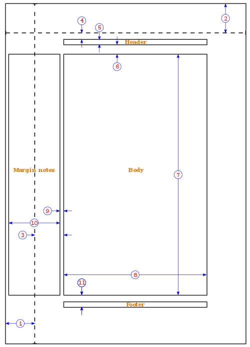

# LaTeX Cheatsheet

## Compilation


1. pdflatex file.latex
2. biber file.latex
   makeglossaries file.latex
3. pdflatex file.latex
4. pdflatex file.latex


## Preamble Basics

[Wikibooks: Document Structure](https://en.wikibooks.org/wiki/LaTeX/Document_Structure#Document_Classes)

Documentclass:

`article, IEEEtran, proc, report, book, slides, memoir, letter, beamer`

options: 

`10pt/11pt/12pt/..., a4paper, titlepage/notitlepage, onecolumn/twocolumn, oneside/twoside, landscape, openright/openall`


## Document Environment


Topmatter:

```
\begin{document}
\title{How to Structure a LaTeX Document}
\author{Andrew Roberts}
\date{December 2004}
\maketitle
\end{document}
```


Abstract:

```
\begin{abstract}
Your abstract goes here...
...
\end{abstract}
```
```
\renewcommand{\abstractname}{Executive Summary}
```

Structure:

```
Command	                         Level
\part{''part''}	                   -1	
\chapter{''chapter''}	            0	    (only books and reports)
\section{''section''}	            1	
\subsection{''subsection''}	        2	
\subsubsection{''subsubsection''}	3	
\paragraph{''paragraph''}	        4	
\subparagraph{''subparagraph''}	    5
```


## Page Layout



1. one inch + \hoffset
2. one inch + \voffset
3. \oddsidemargin = 31pt
4. \topmargin = 20pt
5. \headheight = 12pt
6. \headsep = 25pt
7. \textheight = 592pt
8. \textwidth = 390pt
9. \marginparsep = 10pt
10. \marginparwidth = 35pt
11. \footskip = 30pt
12. \marginparpush = 7pt (not shown)
13. \hoffset = 0pt
14. \voffset = 0pt
15. \paperwidth = 597pt
16. \paperheight = 845pt


```
\usepackage[top=1in, bottom=1.25in, left=1.25in, right=1.25in]{geometry}
```
```
\usepackage[showframe]{geometry}
```
```
\setlength{\textwidth}{6.5in}
\addtolength{\voffset}{-5pt}
```


## Titles

http://www.ctex.org/documents/packages/layout/titlesec.pdf

```
\usepackage{titlesec}
\titlespacing*{\chapter}{0pt}{-50pt}{20pt}
\titleformat{\chapter}[display]{\normalfont\huge\bfseries}{\chaptertitlename\ \thechapter}{20pt}{\Huge}
```